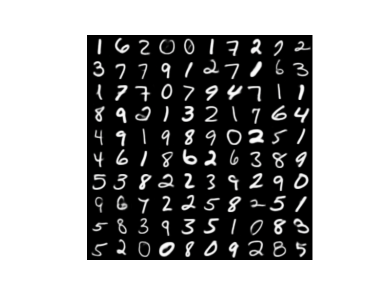
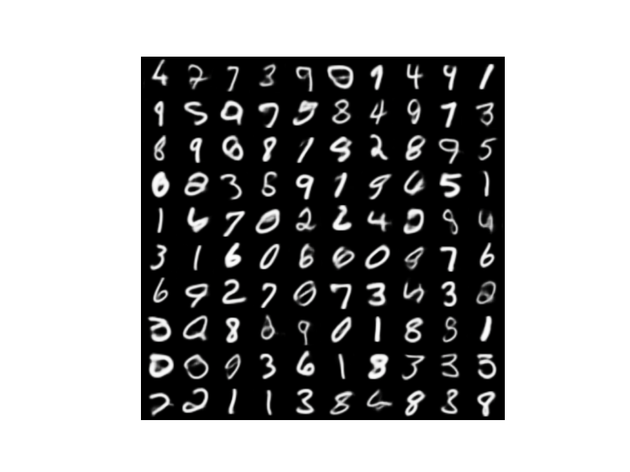
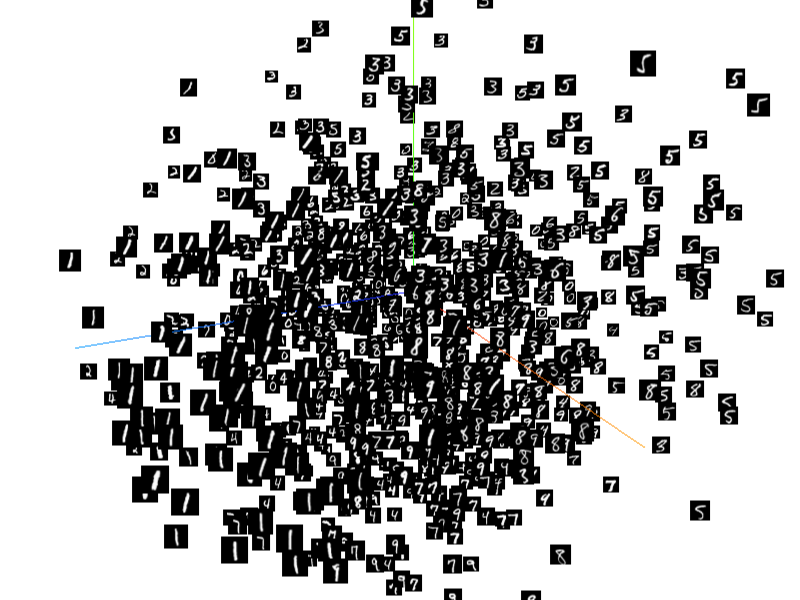
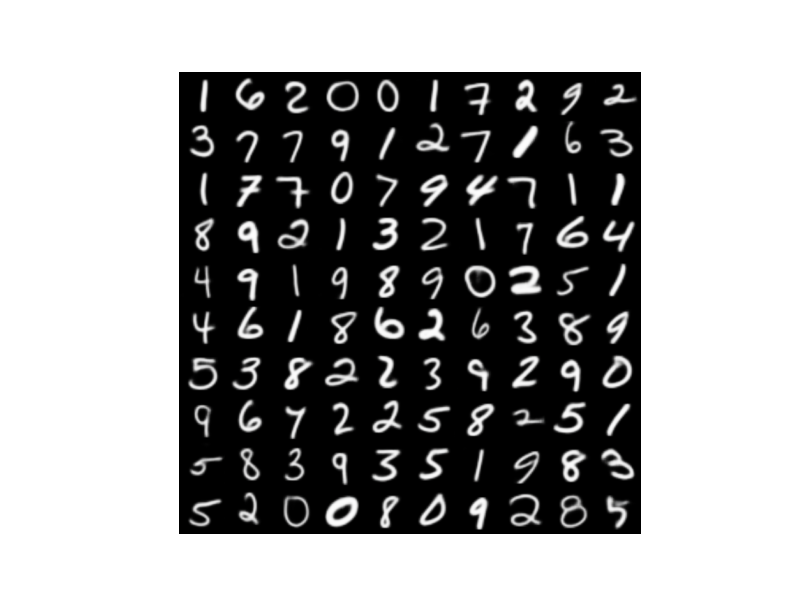
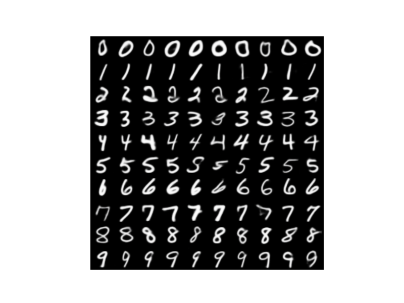
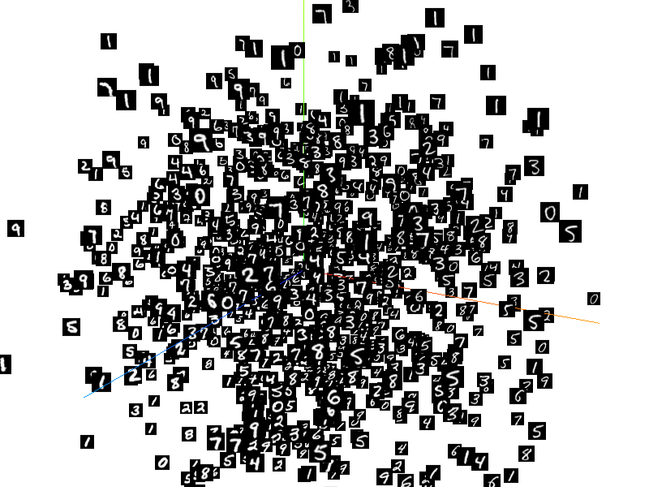

# vae

This repository contains the pytorch implementation of the following papers:
* [Auto-Encoding Variational Bayes](https://arxiv.org/abs/1312.6114) (VAE)
* [Learning Structured Output Representation using Deep Conditional Generative Models](https://papers.nips.cc/paper_files/paper/2015/hash/8d55a249e6baa5c06772297520da2051-Abstract.html) (CVAE)

## Features
* Pytorch implementation.
* Tensorboard logs and visualizations throughout training.
* Latent space visualizations (see [here](#sample-results) for examples).

## Getting started

### Prerequisites
Run the below command to install all the required python dependencies:
```
pip install -r requirements.txt
```

### Usage
Simply open the corresponding jupyter notebook with your favorite editor and run the cells. Training logs and visualizations will be displayed through tensorboard, which can be started by running the below command:
```
tensorboard --logdir=<dir-to-logs>
```

## Sample results

|                               | Reconstruction                         | Generation                           | Latent Space (PCA)                   |
|:-----------------------------:|:--------------------------------------:|:------------------------------------:|:------------------------------------:|
| **VAE**                       |         |         |      |
| **CVAE**                      |        |        |     |

